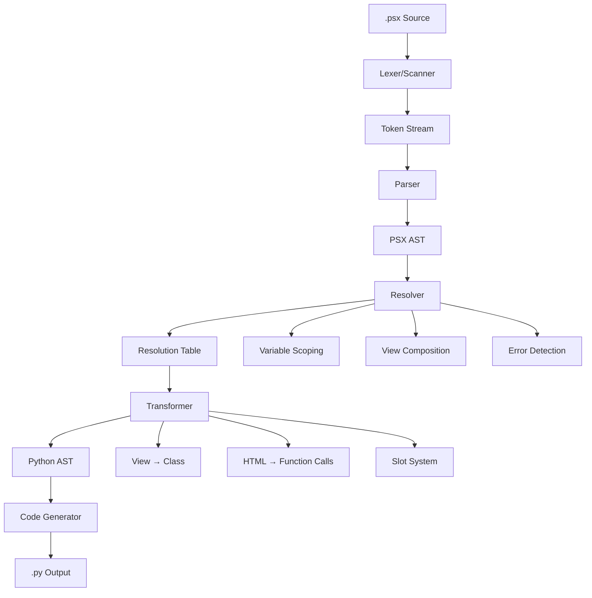

# Sylfie Compiler Architecture

## Table of Contents

1. [Overview](#overview)
2. [Compilation Pipeline](#compilation-pipeline)
3. [Lexical Analysis (Scanner)](#lexical-analysis-scanner)
4. [Parsing](#parsing)
5. [Semantic Analysis (Resolver)](#semantic-analysis-resolver)
6. [AST Transformation](#ast-transformation)
7. [Code Generation](#code-generation)
8. [Runtime System](#runtime-system)
9. [File System Integration](#file-system-integration)
10. [CLI Interface](#cli-interface)
11. [Examples and Use Cases](#examples-and-use-cases)

## Overview

Sylfie is a modern web framework that extends Python with HTML-like syntax for building server-side rendered applications. The Sylfie compiler is a sophisticated transpiler that converts `.psx` (Python Sylfie eXtension) files into standard Python code, enabling developers to write component-based web applications with React-like syntax while maintaining full Python compatibility.

### Key Features

- **JSX-like syntax** for Python web development
- **Component-based architecture** with view composition
- **Type-safe** with full Python type annotation support
- **Slot system** for flexible component composition
- **Server-side rendering** with automatic HTML escaping
- **Hot reloading** support for development

### Architecture Principles

1. **Multi-phase compilation** with clear separation of concerns
2. **Visitor pattern** for extensible AST processing
3. **Error recovery** to provide comprehensive feedback
4. **Runtime integration** with caching and optimization
5. **Development-friendly** tooling with live compilation

## Compilation Pipeline

The Sylfie compiler follows a traditional compiler architecture with modern enhancements:



### Pipeline Phases

1. **Lexical Analysis**: Source code → Token stream
2. **Parsing**: Token stream → PSX AST
3. **Semantic Analysis**: AST + Resolution → Annotated AST
4. **Transformation**: PSX AST → Python AST
5. **Code Generation**: Python AST → Python source code

## Lexical Analysis (Scanner)

### Architecture

The lexer is implemented as a hand-written scanner supporting **multi-mode lexing** to handle the complex syntax requirements of PSX:

```go
type Scanner struct {
    src          []byte           // Source code as UTF-8 bytes
    start, cur   int              // Lexeme boundaries
    line, col    int              // Position tracking (1-based)
    tokens       []Token          // Accumulated token stream
    indentStack  []int            // Python indentation tracking
    fstringStack []fstringContext // F-string nesting state
    ctx          LexerContext     // Current lexing mode
}
```

### Multi-Mode Lexing

The scanner operates in **4 distinct modes** to handle different syntactic contexts:

#### 1. Python Mode (Default)
- Standard Python 3.12+ tokenization
- Keywords, operators, literals, identifiers
- F-string parsing with nested expressions
- Indentation-sensitive INDENT/DEDENT tokens

#### 2. HTML Tag Mode
- HTML element opening/closing tags: `<div>`, `</div>`
- Attribute parsing: `class="container" id={variable}`
- Self-closing tags: ``

#### 3. HTML Content Mode  
- Text content between HTML tags
- HTML interpolations: `{expression}`
- Mixed newlines and Python statement detection

#### 4. HTML Interpolation Mode
- Python expressions inside `{...}` within HTML
- Nested brace tracking and expression parsing
- Mode stack for proper context restoration

### Token System

The lexer recognizes **146 distinct token types** organized into categories:

```go
// Core categories
const (
    // Literals and identifiers
    Identifier = iota
    String
    Number
    
    // Python operators and punctuation
    Plus, Minus, Star, Slash, Percent
    Equal, EqualEqual, BangEqual, Less, Greater
    
    // F-string tokens
    FStringStart, FStringMiddle, FStringEnd
    LeftBraceF, RightBraceF
    
    // HTML/PSX tokens  
    TagOpen, TagClose, TagSelfClose
    HTMLTextInline, HTMLInterpolationStart
    
    // Layout tokens
    Newline, Indent, Dedent
    
    // Python keywords (36 total)
    And, As, Assert, Async, Await, Break, Class, Continue, Def, Del, Elif, Else, Except, False, Finally, For, From, Global, If, Import, In, Is, Lambda, None, Nonlocal, Not, Or, Pass, Raise, Return, True, Try, While, With, Yield
    
    // Sylfie keywords
    View, Component
)
```

### Complex Tokenization Examples

#### Nested F-Strings
Input: `f"User: {user.name if user else f'{default_name.title()}'}"` 

Token sequence:
1. `FStringStart` → `f"`
2. `FStringMiddle` → `"User: "`
3. `LeftBraceF` → `{`
4. `Identifier` → `user`, `.`, `name`
5. `If` → `if`, `Identifier` → `user`
6. `Else` → `else`
7. `FStringStart` → `f'` (nested f-string)
8. `LeftBraceF` → `{`
9. `Identifier` → `default_name`, `.`, `title`, `(`, `)`
10. `RightBraceF` → `}`
11. `FStringEnd` → `'`
12. `RightBraceF` → `}`
13. `FStringEnd` → `"`

#### HTML with Interpolation
Input:
```html
<div class="user-{status}">
    Hello {name}!
</div>
```

Mode transitions:
1. `HTMLTagMode` → `<div class="user-` 
2. `HTMLInterpolationMode` → `{status}`
3. `HTMLTagMode` → `">`
4. `HTMLContentMode` → whitespace and `Hello `
5. `HTMLInterpolationMode` → `{name}`  
6. `HTMLContentMode` → `!`
7. `HTMLTagMode` → `</div>`

### Indentation Handling

The scanner implements Python's precise indentation rules using a stack-based algorithm:

```go
func (s *Scanner) handleIndentation() {
    indent := s.measureIndentation() // Count spaces/tabs
    top := s.indentStack[len(s.indentStack)-1]
    
    switch {
    case indent > top:
        // Increased indentation
        s.indentStack = append(s.indentStack, indent)
        s.addToken(Indent)
        
    case indent < top:
        // Decreased indentation - may need multiple DEDENTs
        for indent < top && len(s.indentStack) > 1 {
            s.indentStack = s.indentStack[:len(s.indentStack)-1]
            top = s.indentStack[len(s.indentStack)-1]
            s.addToken(Dedent)
        }
        
        if indent != top {
            s.errorf("inconsistent indentation")
        }
    }
}
```

## Parsing

### Recursive Descent Architecture

The parser implements a **recursive descent parser** with **operator precedence climbing** for expressions:

```go
type Parser struct {
    Tokens  []lexer.Token  // Token stream from lexer
    Current int            // Current position in token stream
    Errors  []error        // Accumulated parsing errors
}
```

### Expression Precedence Hierarchy

The parser implements Python's complete operator precedence through a chain of methods:

1. **`expression()`** → Lambda expressions, ternary conditionals (`x if cond else y`)
2. **`disjunction()`** → Logical OR (`or`)
3. **`conjunction()`** → Logical AND (`and`)  
4. **`inversion()`** → Logical NOT (`not`)
5. **`comparison()`** → Comparisons (`==`, `!=`, `<`, `>`, `is`, `in`, etc.)
6. **`bitwiseOr()`** → Bitwise OR (`|`)
7. **`bitwiseXor()`** → Bitwise XOR (`^`)
8. **`bitwiseAnd()`** → Bitwise AND (`&`)
9. **`shiftExpr()`** → Bit shifts (`<<`, `>>`)
10. **`sum()`** → Addition/subtraction (`+`, `-`)
11. **`term()`** → Multiplication/division (`*`, `/`, `//`, `%`, `@`)
12. **`factor()`** → Unary operators (`+`, `-`, `~`)
13. **`power()`** → Exponentiation (`**`) - right-associative
14. **`await()`** → Await expressions
15. **`primary()`** → Function calls, attribute access, subscripts
16. **`atom()`** → Literals, identifiers, collections

### PSX-Specific Parsing

#### View Statements
Views are parsed as function-like constructs with special body handling:

```go
func (p *Parser) viewStatement() (ast.Stmt, error) {
    // view Name[TypeParams](params) -> ReturnType: body
    // Body can contain Python statements AND HTML elements
    // Supports both single-line and compound bodies
}
```

#### HTML Elements
HTML elements are parsed in three forms:

1. **Self-closing**: ``
2. **Single-line**: `<span>content</span>`
3. **Multi-line** with indentation:
   ```html
   <div>
       nested content
   </div>
   ```

```go
func (p *Parser) htmlElement() (ast.Stmt, error) {
    tagName := p.advance() // TagOpen token
    
    // Parse attributes
    attributes := p.parseAttributes()
    
    // Determine element type and parse content
    elementType, content := p.parseElementContent(tagName)
    
    return &ast.HTMLElement{
        TagName:    tagName,
        Attributes: attributes,
        Content:    content,
        Type:       elementType,
    }, nil
}
```

### AST Structure

The AST uses the **Visitor pattern** for extensible tree traversal:

```go
type Node interface {
    Accept(visitor Visitor)  // Visitor pattern entry point
    GetSpan() lexer.Span    // Source location tracking
    String() string         // Debug representation
}

type Expr interface {
    Node
    isExpr()  // Marker method for type safety
}

type Stmt interface {
    Node  
    isStmt()  // Marker method for type safety
}
```

#### Key AST Node Types

**Sylfie-specific nodes**:
- `ViewStmt` → View definitions with parameters and body
- `HTMLElement` → HTML elements with attributes and content
- `HTMLContent` → Mixed text and interpolation content

**Python nodes** (subset):
- `Module` → Root AST node containing statements
- `Function`, `Class` → Function and class definitions
- `If`, `For`, `While` → Control flow statements
- `Binary`, `Unary` → Expression nodes
- `Call`, `Attribute`, `Subscript` → Complex expressions

### Error Handling

The parser implements **comprehensive error recovery**:

1. **Synchronization points** at statement boundaries
2. **Multiple error collection** continues parsing after errors
3. **Position restoration** for backtracking in ambiguous constructs
4. **Context-aware error messages** based on parsing state

```go
func (p *Parser) synchronize() {
    // Recover to statement boundaries after errors
    for !p.atEnd() {
        if p.previous().Type == lexer.Newline {
            return
        }
        switch p.peek().Type {
        case lexer.Class, lexer.Def, lexer.For, lexer.If, lexer.While, lexer.Return:
            return
        }
        p.advance()
    }
}
```

## Semantic Analysis (Resolver)

The resolver implements **Python's LEGB scoping rules** while adding support for **Sylfie's view composition system**.

### Scope Management

```go
type Resolver struct {
    Scopes       []*Environment            // Scope stack  
    Current      *Environment              // Current scope
    Variables    map[*ast.Name]*Variable   // Name → Variable mapping
    ScopeDepths  map[*ast.Name]int         // Name → scope distance
    Views        map[string]*ast.ViewStmt  // View definitions
    ViewElements map[*ast.HTMLElement]*ast.ViewStmt // View composition
}

type Environment struct {
    Enclosing  *Environment            // Parent scope
    Values     map[string]*Variable    // Local variables
    ScopeType  ScopeType              // Scope classification
    Globals    map[string]*Variable   // 'global' declarations
    Nonlocals  map[string]*Variable   // 'nonlocal' declarations
}
```

### LEGB Resolution Algorithm

The resolver implements Python's **Local → Enclosing → Global → Built-in** resolution order:

```go
func (r *Resolver) ResolveName(name *ast.Name) error {
    varName := name.Token.Lexeme
    
    // Check explicit declarations first
    if globalVar := r.Current.Globals[varName]; globalVar != nil {
        r.Variables[name] = globalVar
        r.ScopeDepths[name] = 0  // Global scope distance
        return nil
    }
    
    if nonlocalVar := r.Current.Nonlocals[varName]; nonlocalVar != nil {
        r.Variables[name] = nonlocalVar
        nonlocalVar.IsCaptured = true  // Mark for closure
        return nil
    }
    
    // 1. Local scope
    if variable, exists := r.Current.Values[varName]; exists {
        r.Variables[name] = variable
        r.ScopeDepths[name] = len(r.Scopes) - 1
        return nil
    }
    
    // 2. Enclosing scopes (skip class scopes for nested functions)
    for i := len(r.Scopes) - 2; i >= 1; i-- {
        scope := r.Scopes[i]
        
        // Class scope isolation rule
        if scope.ScopeType == ClassScopeType && r.InFunctionScope() {
            continue
        }
        
        if variable, exists := scope.Values[varName]; exists {
            variable.IsCaptured = true  // Mark for closure
            r.ScopeDepths[name] = i
            return nil
        }
    }
    
    // 3. Global scope (module level)
    if variable, exists := r.ModuleGlobals[varName]; exists {
        r.ScopeDepths[name] = 0
        return nil
    }
    
    // 4. Built-ins (assume global/builtin)
    variable := &Variable{
        Name:  varName,
        State: VariableUndefined,  // May be builtin
    }
    r.ModuleGlobals[varName] = variable
    r.Variables[name] = variable
    r.ScopeDepths[name] = 0
    
    return nil
}
```

### Variable Lifecycle

Variables track their usage throughout compilation:

```go
type Variable struct {
    Name            string
    State           VariableState  // Undefined, Declared, Defined, Used
    DefinitionDepth int           // Absolute scope depth
    
    // Scoping flags
    IsParameter     bool  // Function parameter
    IsGlobal        bool  // 'global' declaration
    IsNonlocal      bool  // 'nonlocal' declaration  
    IsViewParameter bool  // Sylfie view parameter
    
    // Closure analysis
    IsCaptured      bool  // Used in nested scopes
    IsCell          bool  // Needs cell variable for closure
}
```

### View Composition Analysis

The resolver tracks view definitions and their usage as HTML elements:

```go
func (r *Resolver) VisitViewStmt(v *ast.ViewStmt) ast.Visitor {
    // Register view definition (module scope only)
    if r.Current.ScopeType == ModuleScopeType {
        r.Views[v.Name.Token.Lexeme] = v
    }
    
    r.BeginScope(ViewScopeType)
    defer r.EndScope()
    
    // Process view parameters as local variables
    for _, param := range v.Params.Parameters {
        variable := r.DefineVariable(param.Name.Token.Lexeme, param.Name.Span)
        variable.IsParameter = true
        variable.IsViewParameter = true
        variable.State = VariableDefined
    }
    
    // Visit view body
    for _, stmt := range v.Body {
        stmt.Accept(r)
    }
    
    return r
}
```

## AST Transformation

The transformation phase converts **PSX AST nodes into Python AST nodes**, enabling standard Python code generation.

### Transformation Architecture

```go
type TransformerVisitor struct {
    resolver *Resolver           // Resolution information
    views    map[string]*ast.ViewStmt  // Available views
}

type ViewTransformer struct {
    visitor        *TransformerVisitor
    contextStack   []string       // Children array context stack
    currentContext string         // Current children array name
    nextContextId  int           // Unique ID generation
    slots         map[string]*SlotInfo  // Slot analysis
}
```

### View-to-Class Transformation

#### Input PSX:
```javascript
view UserProfile(user: User, show_email: bool = True):
    <div class="profile">
        <h1>{user.name}</h1>
        if show_email:
            <p>{user.email}</p>
    </div>
```

#### Output Python:
```python
class UserProfile(BaseView):
    def __init__(self, user: User, show_email: bool = True):
        super().__init__()
        self.user = user
        self.show_email = show_email
    
    def _render(self) -> Element:
        _view_children_1000 = []
        _div_children_1234 = []
        _div_children_1234.append(el("h1", escape(self.user.name)))
        if self.show_email:
            _div_children_1234.append(el("p", escape(self.user.email)))
        _view_children_1000.append(el("div", _div_children_1234, {"class": "profile"}))
        return fragment(_view_children_1000)
```

### HTML Element Transformation

HTML elements become calls to the `el()` runtime function:

#### Simple Elements
```html
<div class="container">Hello World</div>
```
↓
```python
el("div", "Hello World", {"class": "container"})
```

#### Complex Nested Elements  
```html
<div class="parent">
    <span>Child 1</span>
    <span>Child 2</span>
</div>
```
↓
```python
el("div", [
    el("span", "Child 1"),
    el("span", "Child 2")  
], {"class": "parent"})
```

#### Dynamic Content
```html
<div class="user">{username}</div>
```
↓  
```python
el("div", escape(self.username), {"class": "user"})
```

### Hierarchical Processing Algorithm

For complex content with control structures, the transformer uses a **children array strategy**:

```go
func (vm *ViewTransformer) needsHierarchicalProcessing(content []ast.Stmt) bool {
    for _, stmt := range content {
        switch stmt.(type) {
        case *ast.For, *ast.If, *ast.While, *ast.With, *ast.Try:
            return true  // Control structures need special handling
        }
    }
    return false
}

func (vm *ViewTransformer) createChildrenArray() string {
    id := vm.nextContextId
    vm.nextContextId++
    return fmt.Sprintf("_children_%d", id)
}
```

When control structures are detected:
1. Create a children array: `_div_children_1234 = []`
2. Transform content statements to append operations
3. Use the array as element content: `el("div", _div_children_1234, attrs)`

### Slot System Implementation

#### Slot Analysis
The transformer first analyzes slot definitions in view bodies:

```go
func (vm *ViewTransformer) analyzeSlots(body []ast.Stmt) {
    for _, stmt := range body {
        if htmlElement, ok := stmt.(*ast.HTMLElement); ok {
            if htmlElement.TagName.Lexeme == "slot" {
                slotName := vm.getSlotName(htmlElement)  // Named or default
                vm.slots[slotName] = &SlotInfo{
                    Name:         slotName,
                    FallbackHTML: htmlElement.Content,
                    Element:      htmlElement,
                }
            }
        }
    }
}
```

#### Slot Parameter Generation
Slots become keyword-only constructor parameters:

```python
def __init__(self, regular_param: str, *, children=None, header=None):
    super().__init__()
    self.regular_param = regular_param
    self.children = children
    self.header = header
```

#### Slot Rendering
Slots use conditional rendering with fallback content:

```python
# In _render method
header_content = (render_child(self.header) if self.header is not None 
                 else el("h1", "Default Header"))
```

### View Composition
When HTML elements reference view names, they're transformed into view instantiation:

```html
<UserCard user={current_user} />
```
↓
```python  
UserCard(user=self.current_user).render()
```

## Code Generation

The final phase generates clean, idiomatic Python code from the transformed AST.

### Code Generator Architecture

```go
type CodeGenerator struct {
    output       strings.Builder
    indentLevel  int
    atLineStart  bool
}

func (cg *CodeGenerator) VisitModule(m *ast.Module) ast.Visitor {
    // Generate required imports
    cg.writeImports()
    
    // Generate module body
    for _, stmt := range m.Body {
        stmt.Accept(cg)
        cg.newline()
    }
    
    return cg
}
```

### Required Imports

The generator automatically adds necessary runtime imports:

```python
from runtime import BaseView, el, escape, Element, FragmentElement, fragment, render_child
```

### Class Generation

View classes are generated with proper Python formatting:

```go
func (cg *CodeGenerator) VisitClass(c *ast.Class) ast.Visitor {
    cg.write("class ")
    c.Name.Accept(cg)
    
    if len(c.Args) > 0 {
        cg.write("(")
        for i, base := range c.Args {
            if i > 0 { cg.write(", ") }
            base.Accept(cg)
        }
        cg.write(")")
    }
    
    cg.write(":")
    cg.newline()
    cg.increaseIndent()
    
    for _, stmt := range c.Body {
        stmt.Accept(cg)
    }
    
    cg.decreaseIndent()
    return cg
}
```

### Expression Generation

Complex expressions maintain proper precedence and formatting:

```go
func (cg *CodeGenerator) VisitBinary(b *ast.Binary) ast.Visitor {
    // Handle parentheses based on precedence
    needsParens := cg.needsParentheses(b.Left, b.Operator)
    if needsParens { cg.write("(") }
    b.Left.Accept(cg)
    if needsParens { cg.write(")") }
    
    cg.write(" ")
    cg.write(b.Operator.Lexeme)
    cg.write(" ")
    
    needsParens = cg.needsParentheses(b.Right, b.Operator)
    if needsParens { cg.write("(") }
    b.Right.Accept(cg)
    if needsParens { cg.write(")") }
    
    return cg
}
```

## Runtime System

The runtime provides the foundation for executing compiled Sylfie applications.

### Core Components

#### BaseView Abstract Class
```python
class BaseView(ABC):
    def __init__(self):
        self._render_cache: Optional[Union[Element, str]] = None
        self._html_cache: Optional[str] = None
    
    @abstractmethod
    def _render(self) -> Union[Element, str]:
        """Generate the view's content - implemented by compiler"""
        pass
    
    def render(self) -> str:
        """Public interface for rendering with caching"""
        if self._html_cache is not None:
            return self._html_cache
        
        result = self._get_rendered() 
        self._html_cache = str(result)
        return self._html_cache
```

#### Element System
```python
class Element:
    def __init__(self, tag: str, content: Union[str, List['Element']], 
                 attrs: Optional[Dict[str, str]] = None):
        self.tag = tag
        self.content = content  
        self.attrs = attrs or {}
        self._html_cache: Optional[str] = None
    
    def __str__(self) -> str:
        if self._html_cache is not None:
            return self._html_cache
        
        # Generate HTML with proper escaping
        attrs_str = self._render_attributes()
        content_str = self._render_content()
        
        if self.tag in VOID_ELEMENTS:
            self._html_cache = f"<{self.tag}{attrs_str} />"
        else:
            self._html_cache = f"<{self.tag}{attrs_str}>{content_str}</{self.tag}>"
        
        return self._html_cache
```

#### Factory Functions
```python
def el(tag: str, content: Union[str, List[Element]] = "", 
       attrs: Optional[Dict[str, str]] = None) -> Element:
    """Create HTML elements with automatic escaping"""
    return Element(tag, content, attrs)

def escape(value: Any) -> str:
    """HTML escape dynamic content for security"""
    if value is None:
        return ""
    return html.escape(str(value))

def fragment(children: List[Element]) -> FragmentElement:
    """Container for multiple elements without wrapper"""
    return FragmentElement(children)

def render_child(child: Any) -> str:
    """Render arbitrary content (views, elements, strings)"""
    if hasattr(child, 'render'):
        return child.render()
    elif isinstance(child, Element):
        return str(child)
    else:
        return escape(child)
```

### Caching Strategy

The runtime implements **multi-level caching**:

1. **Element-level caching**: HTML strings cached per element
2. **View-level caching**: Rendered output cached per view instance  
3. **Automatic invalidation**: Caches cleared when content changes

### Security Features

- **Automatic HTML escaping** for all dynamic content
- **XSS prevention** through systematic content sanitization
- **Safe attribute handling** with proper quoting

## File System Integration

### Watch System

The compiler includes a sophisticated file watching system for development:

```go
type Watcher struct {
    fsWatcher    *fsnotify.Watcher
    files        map[string]time.Time  // File modification tracking
    debouncer    *time.Timer          // Debounce rapid changes
    compiler     Compiler
}

func (w *Watcher) Watch(patterns []string) error {
    // Recursively watch directories for .psx files
    // Debounce file changes to avoid excessive compilation
    // Support glob patterns for flexible file matching
}
```

### Compilation Modes

1. **Single file compilation**: `sylfie compile file.psx`
2. **Batch compilation**: `sylfie compile src/`
3. **Watch mode**: `sylfie watch src/` (live compilation)
4. **Development tools**: `sylfie scan`, `sylfie parse` for debugging

## CLI Interface

### Command Structure

```go
type CLI struct {
    // Global flags
    Debug     bool   `help:"Enable debug output"`
    Recursive bool   `help:"Process directories recursively"` 
    TreeSitter string `help:"Path to tree-sitter library"`
    
    // Commands
    Compile CompileCmd `cmd:"" help:"Compile Sylfie files to Python"`
    Watch   WatchCmd   `cmd:"" help:"Watch files and compile on changes"`
    Scan    ScanCmd    `cmd:"" help:"Scan files and output tokens"`
    Parse   ParseCmd   `cmd:"" help:"Parse files and output AST"`
}
```

### Usage Examples

```bash
# Compile single file
sylfie compile src/views/user.psx

# Compile directory recursively  
sylfie compile src/ --recursive

# Watch for changes
sylfie watch src/ 

# Debug tokenization
sylfie scan src/views/user.psx --debug

# Debug parsing
sylfie parse src/views/user.psx --debug
```

## Examples and Use Cases

### Complete Application Example

#### Input: `blog.psx`
```javascript
from typing import List

view BlogPost(title: str, content: str, author: str):
    <article class="blog-post">
        <header>
            <h1>{title}</h1>
            <p class="author">By {author}</p>
        </header>
        <div class="content">
            {content}
        </div>
    </article>

view BlogList(posts: List[BlogPost]):
    <div class="blog-list">
        <h1>Latest Posts</h1>
        <div class="posts">
            for post in posts:
                <BlogPost 
                    title={post.title}
                    content={post.content} 
                    author={post.author}
                />
        </div>
    </div>

view BlogLayout():
    <html>
        <head>
            <title>My Blog</title>
            <link rel="stylesheet" href="/static/style.css">
        </head>
        <body>
            <BlogList posts={get_recent_posts()} />
        </body>
    </html>
```

#### Generated: `blog.py`
```python
from runtime import BaseView, el, escape, Element, FragmentElement, fragment, render_child
from typing import List

class BlogPost(BaseView):
    def __init__(self, title: str, content: str, author: str):
        super().__init__()
        self.title = title
        self.content = content
        self.author = author
    
    def _render(self) -> Element:
        _view_children_1000 = []
        _article_children_1234 = []
        _header_children_1567 = []
        _header_children_1567.append(el("h1", escape(self.title)))
        _header_children_1567.append(el("p", escape(f"By {self.author}"), {"class": "author"}))
        _article_children_1234.append(el("header", _header_children_1567))
        _article_children_1234.append(el("div", escape(self.content), {"class": "content"}))
        _view_children_1000.append(el("article", _article_children_1234, {"class": "blog-post"}))
        return fragment(_view_children_1000)

class BlogList(BaseView):
    def __init__(self, posts: List[BlogPost]):
        super().__init__()
        self.posts = posts
    
    def _render(self) -> Element:
        _view_children_2000 = []
        _div_children_2234 = []
        _div_children_2234.append(el("h1", "Latest Posts"))
        _posts_children_2567 = []
        for post in self.posts:
            _posts_children_2567.append(render_child(BlogPost(
                title=post.title,
                content=post.content,
                author=post.author
            )))
        _div_children_2234.append(el("div", _posts_children_2567, {"class": "posts"}))
        _view_children_2000.append(el("div", _div_children_2234, {"class": "blog-list"}))
        return fragment(_view_children_2000)

class BlogLayout(BaseView):
    def __init__(self):
        super().__init__()
    
    def _render(self) -> Element:
        _view_children_3000 = []
        _html_children_3234 = []
        _head_children_3567 = []
        _head_children_3567.append(el("title", "My Blog"))
        _head_children_3567.append(el("link", "", {"rel": "stylesheet", "href": "/static/style.css"}))
        _html_children_3234.append(el("head", _head_children_3567))
        _body_children_3890 = []
        _body_children_3890.append(render_child(BlogList(posts=get_recent_posts())))
        _html_children_3234.append(el("body", _body_children_3890))
        _view_children_3000.append(el("html", _html_children_3234))
        return fragment(_view_children_3000)
```

### FastAPI Integration Example

```python
from fastapi import FastAPI
from fastapi.responses import HTMLResponse
from blog import BlogLayout

app = FastAPI()

@app.get("/", response_class=HTMLResponse)
async def index():
    return BlogLayout().render()

if __name__ == "__main__":
    import uvicorn
    uvicorn.run(app, host="0.0.0.0", port=8000)
```

### Slot System Example

#### Input: Advanced Layout with Slots
```javascript
view PageLayout():
    <html>
        <head>
            <slot name="head">
                <title>Default Title</title>
            </slot>
        </head>
        <body>
            <header>
                <slot name="header">
                    <h1>Default Header</h1>
                </slot>
            </header>
            <main>
                <slot>
                    <p>Default content</p>
                </slot>
            </main>
        </body>
    </html>

view HomePage():
    <PageLayout>
        <title slot="head">Welcome to My Site</title>
        <nav slot="header">
            <a href="/">Home</a>
            <a href="/about">About</a>
        </nav>
        <div>
            <h2>Welcome!</h2>
            <p>This is the home page content.</p>
        </div>
    </PageLayout>
```

#### Generated: Slot Implementation
```python
class PageLayout(BaseView):
    def __init__(self, *, children=None, head=None, header=None):
        super().__init__()
        self.children = children
        self.head = head
        self.header = header
    
    def _render(self) -> Element:
        _view_children_1000 = []
        _html_children_1234 = []
        
        # Head slot with fallback
        head_content = (render_child(self.head) if self.head is not None 
                       else el("title", "Default Title"))
        _html_children_1234.append(el("head", head_content))
        
        # Body with header and main slots
        _body_children_1567 = []
        header_content = (render_child(self.header) if self.header is not None
                         else el("h1", "Default Header"))
        _body_children_1567.append(el("header", header_content))
        
        main_content = (render_child(self.children) if self.children is not None
                       else el("p", "Default content"))
        _body_children_1567.append(el("main", main_content))
        
        _html_children_1234.append(el("body", _body_children_1567))
        _view_children_1000.append(el("html", _html_children_1234))
        return fragment(_view_children_1000)

class HomePage(BaseView):
    def __init__(self):
        super().__init__()
    
    def _render(self) -> Element:
        return render_child(PageLayout(
            head=el("title", "Welcome to My Site"),
            header=el("nav", [
                el("a", "Home", {"href": "/"}),
                el("a", "About", {"href": "/about"})
            ]),
            children=el("div", [
                el("h2", "Welcome!"),
                el("p", "This is the home page content.")
            ])
        ))
```

## Performance Characteristics

### Compilation Performance
- **Single-pass lexing** with minimal backtracking
- **Efficient AST representation** with visitor pattern
- **Incremental compilation** in watch mode
- **Parallel processing** for batch compilation

### Runtime Performance  
- **Multi-level caching** reduces redundant HTML generation
- **Lazy evaluation** of expensive operations
- **Memory efficiency** through object reuse
- **Optimized HTML generation** with minimal string concatenation

### Development Experience
- **Fast hot reloading** with file watching
- **Comprehensive error reporting** with source locations
- **IDE integration** through language server protocol
- **Debug tooling** for tokenization and parsing analysis

## Future Extensions

### Planned Features
1. **Static type checking** with full Python compatibility
2. **CSS-in-JS** integration for styled components  
3. **Server-side streaming** for large applications
4. **Component lifecycle hooks** for advanced use cases
5. **Build-time optimizations** for production deployments

### Architecture Extensions
1. **Plugin system** for custom transformations
2. **Language server** for IDE integration
3. **Debug adapter** for step-through debugging
4. **Test framework** integration for component testing
5. **Documentation generator** from source comments

This architecture provides a solid foundation for building modern web applications with Python, combining the expressiveness of JSX-like syntax with the robustness and type safety of Python's ecosystem.