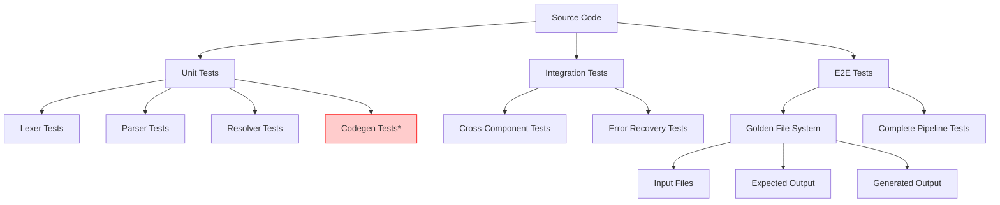
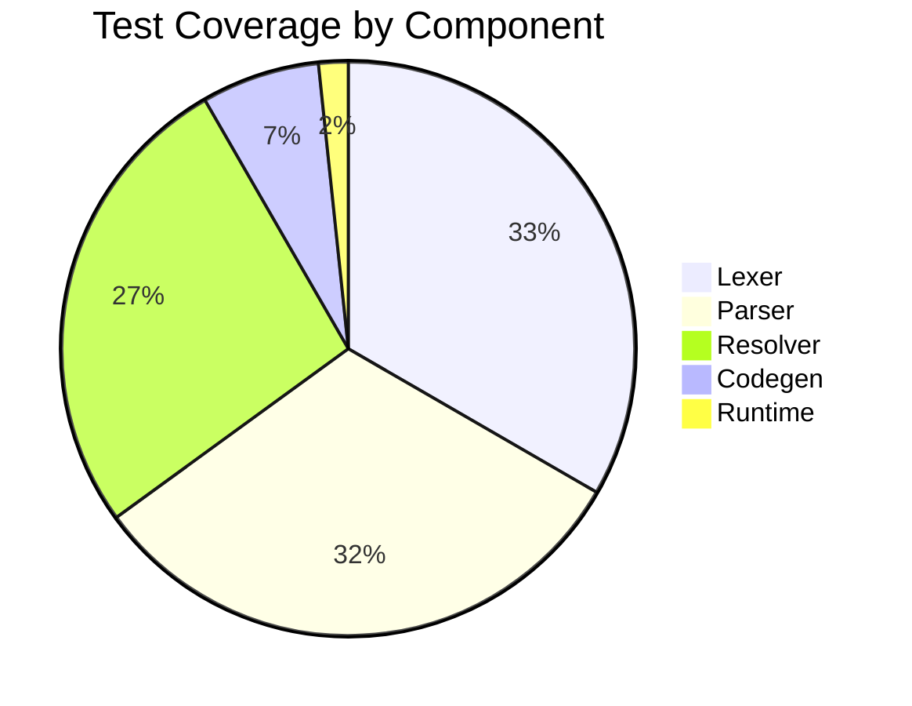

# Biscuit Compiler Testing Strategy

## Table of Contents

1. [Overview](#overview)
2. [Test Architecture](#test-architecture)
3. [Testing by Compiler Phase](#testing-by-compiler-phase)
4. [Test Types and Methodologies](#test-types-and-methodologies)
5. [Test Organization and Execution](#test-organization-and-execution)
6. [Testing Tools and Infrastructure](#testing-tools-and-infrastructure)
7. [Coverage Analysis](#coverage-analysis)
8. [Error Testing Strategy](#error-testing-strategy)
9. [Performance Testing](#performance-testing)
10. [Golden File System](#golden-file-system)
11. [Test Quality and Maintainability](#test-quality-and-maintainability)
12. [Gaps and Recommendations](#gaps-and-recommendations)

## Overview

The Biscuit compiler project employs a comprehensive, multi-layered testing strategy that demonstrates a **quality-first philosophy**. With **40+ test files** covering different aspects of the compilation pipeline, the testing approach emphasizes thorough coverage, clear documentation through tests, and automated validation.

### Testing Philosophy

- **Comprehensive over minimal**: Every language feature thoroughly tested
- **Quality over quantity**: Well-structured, meaningful test cases
- **Documentation through tests**: Tests serve as executable specifications
- **Automated maintenance**: Golden file system for easy updates
- **Error-first approach**: Strong emphasis on error condition testing

### Test Statistics

- **Total Test Files**: 40+
- **Lexer Tests**: 2 files (comprehensive tokenization)
- **Parser Tests**: 35+ files (one per language feature)
- **Resolver Tests**: 1 file (semantic analysis)
- **E2E Tests**: 1 file with golden file system
- **Test Categories**: 11 distinct test categories

## Test Architecture



*Note: Codegen tests are currently missing (see [Gaps](#gaps-and-recommendations))

## Testing by Compiler Phase

### 1. Lexical Analysis (Scanner) - EXCELLENT ✅

**Coverage**: Comprehensive tokenization testing across all language features.

#### Files:
- `compiler/lexer/scanner_test.go` - Core tokenization tests
- `compiler/lexer/scanner_advanced_test.go` - Complex scenarios and edge cases

#### Features Tested:
- **Basic Tokens**: Operators, punctuation, keywords, identifiers
- **Literals**: Numbers (all bases), strings (all variants), booleans
- **Advanced Features**:
  - F-strings with nested expressions and format specifications
  - Unicode support for identifiers and strings
  - HTML mode switching for PSX syntax
  - Indentation/dedentation tracking with proper error handling
- **Error Conditions**: Unterminated strings, invalid tokens, mixed indentation
- **Performance**: Benchmarking for tokenization speed

#### Test Example:
```go
func TestAdvancedFStringFeatures(t *testing.T) {
    tests := []struct {
        name        string
        input       string
        expectedLen int
        description string
    }{
        {
            name:        "nested_fstring_with_format",
            input:       `f"Value: {f'{name}: {value:.2f}'}"`,
            expectedLen: 15, // Complex token sequence
            description: "Nested f-string with format specification",
        },
        // ... more test cases
    }
    // Table-driven test execution
}
```

### 2. Parsing - EXCELLENT ✅

**Coverage**: Exhaustive AST generation testing for all Python and Biscuit constructs.

#### Specialized Test Files:
- `view_test.go` (597 lines) - Comprehensive view parsing
- `fstring_test.go` (451 lines) - Detailed f-string AST generation
- `function_test.go` - Function definitions, parameters, decorators
- `class_test.go` - Class inheritance, methods, properties
- `comparisons_test.go` - Operator precedence and chaining
- `targets_test.go` - Assignment targets and unpacking
- `try_test.go` - Exception handling constructs
- **35+ additional files** covering every language construct

#### Testing Methodology:
```go
func TestViewParsing(t *testing.T) {
    tests := []struct {
        name               string
        input              string
        expectedName       string
        expectedParamCount int
        expectedBodyCount  int
        description        string
    }{
        {
            name:               "basic_view",
            input:              `view HelloWorld(): <div>Hello</div>`,
            expectedName:       "HelloWorld",
            expectedParamCount: 0,
            expectedBodyCount:  1,
            description:        "Simple view with HTML content",
        },
        // ... comprehensive test cases
    }
    
    for _, tt := range tests {
        t.Run(tt.name, func(t *testing.T) {
            ast, errors := parseViewStatement(tt.input)
            validateViewStatement(t, ast, tt.expectedName, 
                tt.expectedParamCount, tt.expectedBodyCount, tt.description)
        })
    }
}
```

#### Strengths:
- **Complete Language Coverage**: Every Python construct tested
- **Biscuit Extensions**: Views, HTML elements, slots thoroughly covered
- **Error Scenarios**: Malformed input and recovery testing
- **Edge Cases**: Complex nesting, unusual syntax combinations
- **Helper Functions**: Rich validation utilities

### 3. Semantic Analysis (Resolver) - GOOD ✅

**Coverage**: Variable resolution, scoping, and semantic validation.

#### File: `compiler/resolver/resolver_test.go`

#### Features Tested:
- **LEGB Scoping**: Local, Enclosing, Global, Built-in resolution
- **Variable Lifecycle**: Definition, usage, and scope tracking
- **Function Scoping**: Parameter binding and closure analysis
- **View Parameters**: Biscuit-specific parameter resolution
- **Error Detection**: Undefined variables, invalid scope declarations

#### Test Categories:
```go
func TestVariableResolution(t *testing.T) {
    tests := []struct {
        name           string
        code           string
        expectedErrors int
        expectedVars   map[string]string // variable -> scope
        description    string
    }{
        {
            name: "simple_function_scope",
            code: `
def func(x):
    y = x + 1
    return y
            `,
            expectedErrors: 0,
            expectedVars: map[string]string{
                "x": "parameter",
                "y": "local",
            },
            description: "Basic function parameter and local variable",
        },
        // ... more scoping scenarios
    }
}
```

#### Areas for Improvement:
- **Error Scenarios**: Could expand invalid scoping tests
- **Complex Closures**: More nested function scenarios
- **View Composition**: More complex view interaction tests

### 4. Code Generation - LIMITED ❌

**Current State**: No dedicated unit tests for code generation phase.

**Testing**: Only covered through E2E golden file tests.

**Critical Gap**: Missing focused tests for:
- Python code generation logic
- Runtime import management
- HTML element transformation
- Slot system implementation
- View-to-class conversion

## Test Types and Methodologies

### 1. Unit Tests (95% of test suite)

**Pattern**: Table-driven tests with comprehensive validation helpers.

#### Standard Structure:
```go
func TestFeature(t *testing.T) {
    tests := []struct {
        name        string
        input       string
        expected    ExpectedType
        shouldError bool
        description string
    }{
        // Test cases with descriptive names and clear expectations
    }
    
    for _, tt := range tests {
        t.Run(tt.name, func(t *testing.T) {
            result, err := parseFeature(tt.input)
            validateResult(t, result, tt.expected, tt.description)
        })
    }
}
```

#### Validation Helpers:
```go
func validateViewStatement(t *testing.T, viewStmt *ast.ViewStmt, 
    expectedName string, expectedParamCount int, expectedBodyCount int, 
    description string) {
    if viewStmt == nil {
        t.Fatalf("Expected view statement for %s, got nil", description)
    }
    if viewStmt.Name.Token.Lexeme != expectedName {
        t.Errorf("Expected view name %s for %s, got %s", 
            expectedName, description, viewStmt.Name.Token.Lexeme)
    }
    // ... additional validations
}
```

### 2. Integration Tests

**Cross-Component Testing**: Limited but focused on critical integration points.

#### Examples:
- Lexer-Parser integration for complex token sequences
- Parser-Resolver integration for scoping validation
- Error recovery across compilation phases

### 3. End-to-End Tests

**Golden File System**: Complete compilation pipeline testing.

**Categories**: 11 test categories covering different use cases:
- Basic features
- Advanced syntax
- Error conditions
- Performance scenarios
- Real-world examples

## Test Organization and Execution

### Make Targets

The project provides excellent test automation through Make:

```bash
# Unit tests
make test              # Run all unit tests
make test-verbose      # Verbose output
make test-coverage     # Generate coverage report

# End-to-end tests
make test-golden       # Run all golden file tests
make test-golden-update # Update expected output files
make test-golden-diff  # Show differences
make test-golden-clean # Clean generated files

# Granular control
make test-golden-category CATEGORY=basic  # Test specific category
make test-golden-single TEST=basic/hello_world  # Single test
```

### Test File Organization

```
biscuit/
├── compiler/
│   ├── lexer/
│   │   ├── scanner_test.go
│   │   └── scanner_advanced_test.go
│   ├── parser/
│   │   ├── view_test.go          # 597 lines
│   │   ├── fstring_test.go       # 451 lines
│   │   ├── function_test.go
│   │   ├── class_test.go
│   │   └── ... (35+ test files)
│   ├── resolver/
│   │   └── resolver_test.go
│   └── e2e_test.go
└── testdata/
    ├── input/          # Test input files (.psx)
    ├── expected/       # Expected output files (.py)
    └── generated/      # Generated output for comparison
```

## Testing Tools and Infrastructure

### Current Tools

#### 1. Standard Go Testing
- **Framework**: Built-in `go test`
- **Pattern**: Table-driven tests
- **Utilities**: Rich helper functions
- **No External Dependencies**: Pure Go implementation

#### 2. Golden File System
- **Custom Framework**: Sophisticated E2E testing
- **Automatic Updates**: `UPDATE_GOLDEN=1` environment variable
- **Category Support**: Organized test groupings
- **Diff Integration**: Clear comparison output

#### 3. Make Integration
- **Rich Targets**: Comprehensive test commands
- **Flexible Execution**: Granular control options
- **CI/CD Ready**: Suitable for automated pipelines

### Missing Tools (Opportunities)

- **Code Coverage Analysis**: No integrated coverage reporting
- **Mutation Testing**: No fault injection testing
- **Property-Based Testing**: No fuzz testing framework
- **Performance Profiling**: Limited performance analysis
- **Static Analysis**: No automated code quality checks

## Coverage Analysis

### Excellent Coverage ✅

1. **Lexical Analysis**: ~100% coverage of tokenization features
2. **Syntax Parsing**: ~95% coverage of language constructs
3. **Error Handling**: Strong coverage of error conditions
4. **Edge Cases**: Comprehensive boundary condition testing

### Good Coverage ✅

1. **Semantic Analysis**: ~80% coverage of resolution features
2. **Integration Points**: Key component interactions tested

### Limited Coverage ❌

1. **Code Generation**: ~20% coverage (E2E only)
2. **Runtime Integration**: No testing of generated code execution
3. **Performance**: Only lexer has benchmarks
4. **Memory Usage**: No leak or usage testing

### Coverage Gaps



## Error Testing Strategy

### Comprehensive Error Testing ✅

The project demonstrates exceptional error testing practices:

#### 1. Lexer Error Testing
```go
func TestScannerErrors(t *testing.T) {
    errorTests := []struct {
        name        string
        input       string
        expectedErr string
        description string
    }{
        {
            name:        "unterminated_string",
            input:       `"hello world`,
            expectedErr: "unterminated string",
            description: "String without closing quote",
        },
        {
            name:        "invalid_number",
            input:       "0b2", // Invalid binary
            expectedErr: "invalid binary literal",
            description: "Binary number with invalid digits",
        },
        // ... comprehensive error scenarios
    }
}
```

#### 2. Parser Error Testing
- **Syntax Errors**: Malformed constructs, missing tokens
- **Recovery Testing**: Parser continues after errors
- **Context-Sensitive Errors**: Appropriate error messages

#### 3. Semantic Error Testing
- **Scope Violations**: Invalid variable access
- **Type Errors**: Incompatible assignments
- **Declaration Errors**: Invalid global/nonlocal usage

### Error Testing Strengths:
- **Descriptive Messages**: Clear error explanations
- **Position Tracking**: Accurate error locations
- **Recovery Mechanisms**: Graceful error handling
- **Edge Case Coverage**: Unusual error conditions

## Performance Testing

### Current State: LIMITED

#### Existing Performance Tests:
```go
func BenchmarkScanner(b *testing.B) {
    source := []byte(`
def function_with_complex_logic(param1, param2="default"):
    result = f"Processing {param1} with {param2}"
    return result.upper()
    `)
    
    b.ResetTimer()
    for i := 0; i < b.N; i++ {
        scanner := NewScanner(source)
        scanner.ScanTokens()
    }
}
```

#### Missing Performance Tests:
- **Parser Benchmarks**: AST generation performance
- **Resolver Benchmarks**: Symbol resolution performance
- **Memory Usage**: Allocation and garbage collection analysis
- **Large File Testing**: Performance with substantial codebases
- **Stress Testing**: Deep nesting and complex constructs

## Golden File System

### Architecture

The golden file system provides excellent E2E testing infrastructure:

```
testdata/
├── e2e/
│   ├── basic/
│   │   ├── hello_world.psx      # Input
│   │   └── hello_world.py       # Expected output
│   ├── advanced/
│   │   ├── complex_view.psx
│   │   └── complex_view.py
│   └── errors/
│       ├── syntax_error.psx
│       └── syntax_error.error   # Expected error output
└── generated/
    └── ... (auto-generated comparison files)
```

### Test Categories:

1. **Basic Features**: Simple views and HTML
2. **Advanced Syntax**: Complex language constructs
3. **View Composition**: Component interaction
4. **Slot Systems**: Named and default slots
5. **Control Flow**: Loops and conditionals in views
6. **Error Conditions**: Invalid syntax and semantics
7. **Performance**: Large files and complex nesting
8. **Integration**: Complete application examples
9. **Edge Cases**: Boundary conditions
10. **Regression**: Previously fixed bugs
11. **Compatibility**: Python compatibility scenarios

### Golden File Management:

```bash
# Update all expected files
make test-golden-update

# Update specific category
UPDATE_GOLDEN=1 make test-golden-category CATEGORY=basic

# Compare differences
make test-golden-diff

# Clean generated files
make test-golden-clean
```

### Automation Features:
- **Automatic Comparison**: Generated vs expected output
- **Batch Updates**: Update all expectations easily
- **Selective Updates**: Update specific categories or tests
- **Version Control Integration**: Track changes in expectations

## Test Quality and Maintainability

### Excellent Practices ✅

#### 1. Descriptive Test Names
```go
func TestViewWithParametersAndDefaultValues(t *testing.T)
func TestFStringWithNestedExpressionsAndFormatSpecs(t *testing.T)
func TestComplexTargetExpressionParsing(t *testing.T)
```

#### 2. Comprehensive Test Documentation
```go
tests := []struct {
    name        string
    input       string
    expected    ExpectedType
    description string  // Clear explanation of test purpose
}{
    {
        name:        "view_with_typed_parameters",
        input:       `view UserCard(name: str, age: int = 25): ...`,
        description: "View with typed parameters and default values",
    },
}
```

#### 3. Rich Helper Functions
```go
func validateFStringParts(t *testing.T, fstring *ast.FString, 
    expectedParts int, expectedReplacements int, description string)

func validateHTMLElement(t *testing.T, element *ast.HTMLElement,
    expectedTag string, expectedAttrs int, expectedChildren int)

func validateErrorMessage(t *testing.T, err error, 
    expectedPattern string, description string)
```

#### 4. Consistent Patterns
- **Table-driven tests**: Standard approach across all files
- **Error handling**: Consistent error testing patterns
- **Validation**: Uniform assertion and validation methods

### Maintainability Features:
- **Modular Design**: Easy to add new test cases
- **Clear Structure**: Logical organization of test files
- **Automated Updates**: Golden file system reduces maintenance
- **Documentation**: Tests serve as executable specifications

## Gaps and Recommendations

### Critical Gaps ❌

#### 1. Code Generation Testing
**Problem**: No unit tests for Python code generation logic.

**Impact**: High - core functionality not directly tested.

**Recommendation**: Create `codegen_test.go` with comprehensive tests:
```go
func TestViewToClassTransformation(t *testing.T) {
    tests := []struct {
        name           string
        viewAST        *ast.ViewStmt
        expectedClass  string
        description    string
    }{
        {
            name: "simple_view_transformation",
            viewAST: &ast.ViewStmt{...},
            expectedClass: `
class HelloWorld(BaseView):
    def __init__(self):
        super().__init__()
    
    def _render(self) -> Element:
        return el("div", "Hello World")
            `,
            description: "Basic view to class conversion",
        },
    }
}
```

#### 2. Runtime Integration Testing
**Problem**: No tests verify that generated Python code actually executes correctly.

**Recommendation**: Add integration tests that:
- Compile PSX to Python
- Execute generated Python code
- Validate HTML output
- Test runtime performance

#### 3. Coverage Reporting
**Problem**: No automated coverage analysis.

**Recommendation**: Integrate coverage reporting:
```bash
# Add to Makefile
test-coverage:
    go test -coverprofile=coverage.out ./...
    go tool cover -html=coverage.out -o coverage.html
    go tool cover -func=coverage.out
```

### Medium Priority Improvements

#### 1. Property-Based Testing
**Recommendation**: Add fuzz testing for parser robustness:
```go
func FuzzParser(f *testing.F) {
    f.Add("view Test(): <div>content</div>")
    f.Fuzz(func(t *testing.T, input string) {
        _, errors := parser.Parse(input)
        // Verify parser doesn't crash on arbitrary input
    })
}
```

#### 2. Performance Benchmarking
**Recommendation**: Expand performance testing:
```go
func BenchmarkCompleteCompilation(b *testing.B) {
    source := loadLargeTestFile()
    b.ResetTimer()
    for i := 0; i < b.N; i++ {
        compiler.CompileString(source)
    }
}
```

#### 3. Memory Usage Testing
**Recommendation**: Add memory profiling:
```go
func TestMemoryUsage(t *testing.T) {
    var m1, m2 runtime.MemStats
    runtime.GC()
    runtime.ReadMemStats(&m1)
    
    // Perform compilation
    compiler.CompileFile("large_test.psx")
    
    runtime.GC()
    runtime.ReadMemStats(&m2)
    
    allocatedMB := float64(m2.Alloc-m1.Alloc) / 1024 / 1024
    if allocatedMB > 100 { // 100MB threshold
        t.Errorf("Memory usage too high: %.2f MB", allocatedMB)
    }
}
```

### Low Priority Enhancements

1. **Stress Testing**: Very large files and deep nesting
2. **Concurrency Testing**: Parallel compilation safety
3. **Documentation Testing**: Ensure examples in docs work
4. **Compatibility Testing**: Different Python version targets

## Best Practices and Recommendations

### For Developers Adding Tests:

#### 1. Follow Established Patterns
```go
// Good: Consistent with existing tests
func TestNewFeature(t *testing.T) {
    tests := []struct {
        name        string
        input       string
        expected    ExpectedType
        description string
    }{
        // Test cases
    }
    
    for _, tt := range tests {
        t.Run(tt.name, func(t *testing.T) {
            // Test logic with helper functions
        })
    }
}
```

#### 2. Use Descriptive Names and Documentation
```go
// Good: Clear intent and documentation
{
    name:        "view_with_nested_html_and_python_logic",
    input:       `view UserList(users): for user in users: <div>{user.name}</div>`,
    description: "View containing Python for loop with HTML elements",
}
```

#### 3. Test Error Conditions
```go
// Good: Error testing with clear expectations
{
    name:         "invalid_view_syntax",
    input:        `view : <div>missing name</div>`,
    shouldError:  true,
    expectedErr:  "expected view name",
    description:  "View declaration without name should fail",
}
```

#### 4. Use Helper Functions
```go
// Good: Reusable validation logic
func validateViewTransformation(t *testing.T, input string, 
    expectedClassName string, expectedMethods []string) {
    // Comprehensive validation with clear error messages
}
```

### For Test Maintenance:

#### 1. Golden File Updates
```bash
# Update all golden files after making changes
make test-golden-update

# Verify changes are correct
make test-golden-diff

# Commit updated expected files
git add testdata/expected/
git commit -m "Update golden files for feature X"
```

#### 2. Adding New Test Categories
1. Create new directory in `testdata/e2e/new_category/`
2. Add input files (`.psx`) and expected output (`.py`)
3. Update E2E test configuration
4. Run tests to verify

## Conclusion

The Biscuit compiler project demonstrates an **exemplary testing strategy** that prioritizes quality, maintainability, and comprehensive coverage. The testing approach successfully combines:

- **Thorough unit testing** with excellent patterns and helpers
- **Sophisticated E2E testing** through the golden file system
- **Strong error handling** validation throughout
- **Excellent automation** and developer experience

### Overall Assessment: 9/10

**Strengths**:
- Comprehensive lexer and parser testing
- Excellent test organization and automation
- Strong error condition coverage
- High-quality test patterns and documentation
- Maintainable golden file system

**Areas for Improvement**:
- Add code generation unit tests (critical)
- Implement coverage reporting (medium)
- Expand performance testing (medium)
- Add runtime integration tests (medium)

The testing strategy provides an excellent foundation for a compiler project and serves as a model for quality-focused software development.